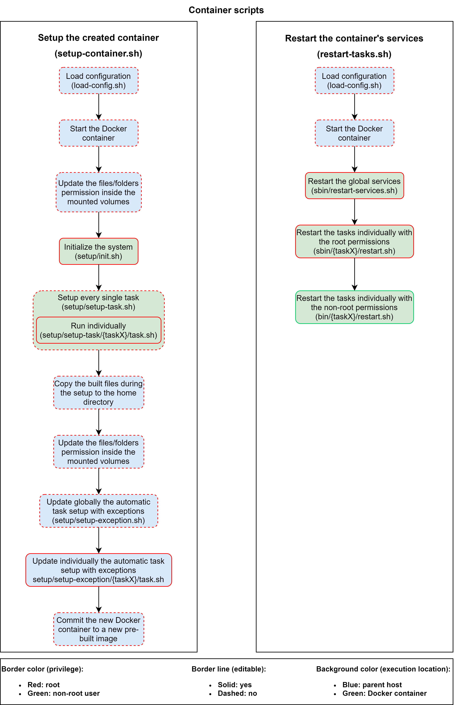

# Multi-CTF-Tasks-Deploy
Repository to deploy multiple CTF tasks instances using docker.

You can create multiple CTF instances hosted on the same server automatically.

## Configuration

Every Docker container is defined by a single folder under `projects/[PREFIX]/[TYPE]/[ID]/`. For the time being you need to manually create that folders tree and then you copy `templates/tasks/*` inside `projects/[PREFIX]/[TYPE]/[ID]/`.

There are 2 configuration files:

- `docker-compose-files/dcf-[YOUR_CUSTOM_CTF_NAME].yml`: This file will define the docker containers that will be created. You can check an example in
[docker-compose-files/dcf-example.yml.example](docker-compose-files/dcf-example.yml.example). You can create your own files or you can rename that file and use it on your own way.
- `config.json`: This file will define the reverse proxy configuration. This is mainly used to serve HTTP(S) requests. If you'll need this feature, you have to copy `config.json.example` to `config.json` and edit it on your own way.

After you create the container's project inside `projects/[PREFIX]/[TYPE]/[ID]/` using `templates/tasks` template, you need to edit the following files based on your need:

- Copy `projects/[PREFIX]/[TYPE]/[ID]/config.json.example` to `projects/[PREFIX]/[TYPE]/[ID]/config.json` and edit it.
- Define the global system initialization needed for the Docker container inside `projects/[PREFIX]/[TYPE]/[ID]/setup/init.sh`.
- Create the setup tasks folders inside `projects/[PREFIX]/[TYPE]/[ID]/setup/setup-task/` and create the script `projects/[PREFIX]/[TYPE]/[ID]/setup/setup-task/{taskX}/task.sh` that will define how the task should be setup (including the system initialization for that particular task).
- Create the setup exception folders inside `projects/[PREFIX]/[TYPE]/[ID]/setup/setup-exception/` and create the script `projects/[PREFIX]/[TYPE]/[ID]/setup/setup-exception/{taskX}/task.sh` that will apply some updates that were previously overrided by the automatic setup (the permissions for example).
- Edit the `projects/[PREFIX]/[TYPE]/[ID]/sbin/restart-services.sh` script and add the commands used to restart the global services
- Create the task restart folders inside `projects/[PREFIX]/[TYPE]/[ID]/sbin/` and create the script `projects/[PREFIX]/[TYPE]/[ID]/sbin/{taskX}/restart.sh` that will be used to restart a specific task using the root permissions (similar to `projects/[PREFIX]/[TYPE]/[ID]/sbin/restart-services.sh`).
- Create the task restart folders inside `projects/[PREFIX]/[TYPE]/[ID]/bin/` and create the script `projects/[PREFIX]/[TYPE]/[ID]/bin/{taskX}/restart.sh` that will be used to restart a specific task using the task user permissions

## Notice

Please read carefully the TLS certificate setup and how it works before you abuse the certbot servers with the continuous TLS setup (when `config.json`:`tls[].enabled` is set to `1`) as this part is not fully automated yet.

## Features

- [x] Multiple tasks per Docker container
- [x] Multiple Docker containers (using `docker-compose`)
- [x] Defined project template (from `templates/tasks`)
- [ ] Automated Docker container projects creation (for the time being this is done manually inside `projects/[PREFIX]/[TYPE]/[ID]/` from the project template `templates/tasks`)
- [x] Automated Docker containers setup
  - [x] Configurable Docker containers using Dockerfile (inside `projects/[PREFIX]/[TYPE]/[ID]/`)
  - [x] Configurable Docker containers using docker-compose files globally (inside `docker-compose-files/dcf-*.yml`)
  - [ ] Defined docker-compose template
    - [x] docker-compose template for the reverse proxy and certbot (inside `dcf-docker-compose-common.yml`)
    - [ ] docker-compose template for the tasks (defined as an example instead `docker-compose-files/dcf-example.yml.example` but it's not included in the automation as it should be included from `templates` directory)
  - [x] Automated system initialization
  - [x] Automated system initialization (using `1-setup-docker.sh`)
  - [x] Automated docker-compose files creation (using `2-create-new-projects-docker.sh`)
    - [x] docker-compose file for the reverse proxy and certbot (using the template `docker-compose-common-template.yml`)
    - [ ] docker-compose file for the tasks (manually created based on `docker-compose-files/dcf-example.yml.example`)
  - [x] Automated nginx files creation (using `2-create-new-projects-nginx.sh`)
    - [x] For the virtual hosts that are mapping the traffic to the reverse proxy and certbot
    - [x] For the virtual hosts that are mapping the traffic to the tasks
  - [x] Automated TLS certificate creation using certbot (using `3-init-letsencrypt.sh`)
    - [x] Configurable creation (using `config.json`)
    - [x] Renewal only when the service is running (protection against renewal exhaustion)
    - [x] Old certificates backup every renewal
    - [ ] Disable email registration once its done
  - [x] Automated TLS certificates renewal (using `4-renew-certificates.sh`)
    - [ ] Scheduled renewal
  - [x] Automated Docker containers rebuild (using `4-rebuild-containers.sh`)
    - [x] Docker container rebuild
    - [x] Tasks setup within the Docker container (using `projects/[PREFIX]/[TYPE]/[ID]/setup-container.sh`)
      - [x] Start the Docker container
      - [x] Initialize the system inside the Docker container
        - [x] Cutomizable system initialization (using `projects/[PREFIX]/[TYPE]/[ID]/setup/init.sh`)
      - [x] Setup the tasks (using `projects/[PREFIX]/[TYPE]/[ID]/setup/setup-task.sh`)
        - [x] Cutomizable tasks setup (using `projects/[PREFIX]/[TYPE]/[ID]/setup/setup-task/{taskX}/task.sh`)
      - [x] Setup the tasks (using `projects/[PREFIX]/[TYPE]/[ID]/setup/setup-task.sh`)
        - [x] Cutomizable tasks setup (using `projects/[PREFIX]/[TYPE]/[ID]/setup/setup-task/{taskX}/task.sh`)
      - [x] Permissions updates (using `projects/[PREFIX]/[TYPE]/[ID]/setup-container.sh`)
        - [ ] Cutomizable permissions updates (using `projects/[PREFIX]/[TYPE]/[ID]/config.json`)
      - [x] Exceptions setup (using `projects/[PREFIX]/[TYPE]/[ID]/setup/setup-exception.sh`)
        - [x] Cutomizable tasks setup (using `projects/[PREFIX]/[TYPE]/[ID]/setup/setup-exception/{taskX}/task.sh`)
      - [x] Docker container persistence (using `docker commit`)
        - [ ] Customizable Docker container persistence (using `projects/[PREFIX]/[TYPE]/[ID]/config.json`)
    - [x] Selective container rebuild (using the script parameters)
    - [x] Granular restart of the setup steps
      - [x] When the script is killed (due to a lack of RAM)
      - [x] Custom number of restarts (fixed to 3)
        - [ ] Configurable number of restarts (using `projects/[PREFIX]/[TYPE]/[ID]/config.json`)
  - [x] Automated Docker containers redeployment (using `4-redeploy-containers.sh`)
    - [x] Selective container redeployment (using the script parameters)
  - [x] Automated containers stop (using `4-stop-containers.sh`)
    - [x] Selective container stop (using the script parameters)
  - [x] Automated tasks restart (using `5-restart-tasks.sh`)
    - [x] Restart the tasks within the Docker container (using `projects/[PREFIX]/[TYPE]/[ID]/restart-tasks.sh`)
      - [x] Start the Docker container
      - [x] Restart the global services using the root permissions (using `projects/[PREFIX]/[TYPE]/[ID]/sbin/restart-services.sh`)
        - [x] Customizable restart (still using `projects/[PREFIX]/[TYPE]/[ID]/sbin/restart-services.sh`)
      - [x] Restart the tasks individually using the root permissions (using `projects/[PREFIX]/[TYPE]/[ID]/sbin/{taskX}/restart.sh`)
        - [x] Customizable restart (still using `projects/[PREFIX]/[TYPE]/[ID]/sbin/{taskX}/restart.sh`)
      - [x] Restart the tasks individually using the non-root permissions (using `projects/[PREFIX]/[TYPE]/[ID]/bin/{taskX}/restart.sh`)
        - [x] Customizable restart (still using `projects/[PREFIX]/[TYPE]/[ID]/bin/{taskX}/restart.sh`)
        - [ ] Restart using custom user (using `projects/[PREFIX]/[TYPE]/[ID]/config.json`)
    - [x] Selective containers that will have their tasks restarted (using the script parameters)
    - [ ] Selective restarted tasks (using the script parameters)
    - [ ] Selective enabled/disabled tasks (using `projects/[PREFIX]/[TYPE]/[ID]/config.json`)
  - [x] Automated reverse proxy restart (using `5-restart-proxy.sh`)

### Project structure

#### Global structure (top directory)

| File path | Description | Writable |
|-----------|-------------|----------|
| `load-config.sh` | Bash script that is used by many scripts that will load the project configuration for an easy access. There is no need to run it manually. | No |
| `0-all-setup.sh` | Bash script that will setup the enabled Docker containers and their tasks and it will automatically start them.<br/>In order to do that it will execute the following Bash scripts:<br/><ul><li>`1-setup-docker.sh`</li><li>`2-create-new-projects-docker.sh`</li><li>`2-create-new-projects-nginx.sh`</li><li>`3-init-letsencrypt.sh`</li><li>`4-rebuild-containers.sh`</li><li>`5-restart-tasks.sh`</li></ul>Execution format:<br/><ul><li>`./0-all-setup.sh.sh` : this will run the script over all the enabled containers and tasks with no restriction</li><li>`./0-all-setup.sh [CONTAINER_NAME1] [CONTAINER_NAME2] [etc]` : This will run the script over the mentioned container names only. This restriction is propagated also to `4-rebuild-containers.sh` and `5-restart-tasks.sh`<ul><li>Example: `./0-all-setup.sh f21web1 f21web3 f21pwn1`.</li></ul></li></ul> | No |
| `1-setup-docker.sh` | Bash script that will initialize the system to make the project work correctly (this includes Docker setup, etc). This script is managed by `0-all-setup.sh` and will be executed once because every time it's executed, a temp file is created locally as `.setup_done` and will prevent it from running again. | No |
| `2-create-new-projects-docker.sh` | Bash script that will create the docker-compose file for the reverse proxy and certbot (for the time being it can't create them for the tasks). This is done based on `templates/docker-compose-common-template.yml`. When dealing with multiple docker-compose files [the volumes paths should be absolute not relative](https://github.com/docker/compose/issues/8275). This is automatically handled by this script. | No |
| `2-create-new-projects-nginx.sh` | Bash script that will create the virtual host configurations under `nginx/sites-enabled/[NAME].conf` and the `nginx/snippets/snakeoil-[NAME].conf` files if TLS is enabled for that specific task. The tasks list that will require the creation of virtual hosts that will be hosted behind the reverse proxy is defined in `config.json` | No |
| `3-init-letsencrypt.sh` | Bash script that will generate the TLS certificates using certbot for all the tasks that are configured in `config.json` for every task that have `projects[].tls-enabled` set as `1`. When the setup is enabled, it'll start by backuping the recently generated TLS certificate from `data/certbot/live/[HOSTNAME]` to `data/certbot/live/[HOSTNAME].bak.[TIMESTAMP]` (used in case certbot server deny the TLS certificate generation request which occurs when the TLS certificate was already generated recently), the certbot configuration files are then generated in `data/certbot/conf/[HOSTNAME].ini` based on the template `templates/letsencrypt-template.ini` and then the script will continue by generating a temporary self-signed TLS certificate valid for 1 day that will be used to enable the HTTPS traffic on the reverse proxy server for that specific task. Obviously the reverse proxy server is restarted after this step. Then, the script check if the web page is reachable or not and when it's reachable, the TLS certificate generation process using certbot starts. This verification is important because if certbot servers receive a lot of requests to generate the same TLS certificate, it'll deny the request. The process is defined with 2 steps: the email registration for the certificate's owner and then comes the TLS certificate generation. Once these 2 steps are performed, the reverse proxy is restarted whatever the result (successful TLS generation or failed). | No |
| `4-rebuild-containers.sh` | Bash script that will rebuild the Docker containers defined in `docker-compose-files/dcf-*.yml`. Then it'll setup the tasks inside the Docker containers using `projects/[PREFIX]/[TYPE]/[ID]/setup-container.sh`.<br/>Execution format:<br/><ul><li>`./4-rebuild-containers.sh` : this will run the script over all the enabled containers and tasks with no restriction</li><li>`./4-rebuild-containers.sh [CONTAINER_NAME1] [CONTAINER_NAME2] [etc]` : This will run the script over the mentioned container names only.<ul><li>Example: `./4-rebuild-containers.sh f21web1 f21web3 f21pwn1`.</li></ul></li></ul> | No |
| `4-redeploy-containers.sh` | Bash script that will redeploy the Docker containers from the pre-built docker images defined in `docker-compose-files/dcf-*.yml`.<br/>Execution format:<br/><ul><li>`./4-redeploy-containers.sh` : this will run the script over all the enabled containers and tasks with no restriction</li><li>`./4-redeploy-containers.sh [CONTAINER_NAME1] [CONTAINER_NAME2] [etc]` : This will run the script over the mentioned container names only.<ul><li>Example: `./4-redeploy-containers.sh f21web1 f21web3 f21pwn1`.</li></ul></li></ul> | No |
| `4-renew-certificates.sh` | Bash script that will execute `2-create-new-projects-docker.sh`, `2-create-new-projects-nginx.sh` and `3-init-letsencrypt.sh` in order to update the projects in case anything is missing, then it renew the TLS certificates using certbot according to the configuration that was set in `config.json` | No |
| `4-stop-containers.sh` | Bash script that will stop all the containers defined in `docker-compose-files/dcf-*.yml`.<br/>Execution format:<br/><ul><li>`./4-stop-containers.sh` : this will run the script over all the enabled containers and tasks with no restriction</li><li>`./4-stop-containers.sh [CONTAINER_NAME1] [CONTAINER_NAME2] [etc]` : This will run the script over the mentioned container names only.<ul><li>Example: `./4-stop-containers.sh f21web1 f21web3 f21pwn1`.</li></ul></li></ul> | No |
| `5-restart-tasks.sh` | Bash script that will restart the services and the tasks within the Docker containers defined in `docker-compose-files/dcf-*.yml` using `projects/[PREFIX]/[TYPE]/[ID]/restart-tasks.sh`.<br/>Execution format:<br/><ul><li>`./5-restart-tasks.sh` : this will run the script over all the enabled containers and tasks with no restriction</li><li>`./5-restart-tasks.sh [CONTAINER_NAME1] [CONTAINER_NAME2] [etc]` : This will run the script over the mentioned container names only.<ul><li>Example: `./5-restart-tasks.sh f21web1 f21web3 f21pwn1`.</li></ul></li></ul>| No |
| `5-restart-proxy.sh` | Bash script that will restart the reverse proxy Docker container defined in `docker-compose-files/docker-compose-files/dcf-docker-compose-common.yml` after refreshing the Nginx and Docker configuration | No |

#### Container structure (inside `projects/[PREFIX]/[TYPE]/[ID]/`)
To be done



### Example

#### Tasks project setup (inside `projects/[PREFIX]/[TYPE]/[ID]/`)
To be done

#### Global managed setup (top directory)
To be done

#### Web services setup in the reverse proxy level

This is an example of a configuration that will let you create four web services as follow:

- Two web services routed to the `f21web1` Docker container:
  - One of them is published on `https://web1.f21.ctf.example.com`. The routed traffic is going to `f21web1:21101`
  - One of them is published on `https://web2.f21.ctf.example.com`. The routed traffic is going to `f21web1:21102`
- One web service routed to the `f21web3` Docker container published on `https://web3.f21.ctf.example.com`. The routed traffic is going to `f21web3:21103`
- One web service routed to the `f21web4` Docker container published on `http://web4.f21.ctf.example.com`. The routed traffic is going to `f21web4:21104`

The TLS certificate setup is enabled for:

- The certificate that have the hostnames `web1.f21.ctf.example.com web2.f21.ctf.example.com` which is used by the reverse proxy to route the traffic to the containers that are using it as a server name (in this example we're talking about the web services that are hosted inside the Docker container `f21web1`). In this is example the services `f21web1-1` and `f21web1-2` are knowing to be using this certificate because of the field `generic-hostname` (see the field description below).

The TLS certificate setup is disabled for:
- The certificate that have the hostnames `web3.f21.ctf.example.com` which is used by the reverse proxy to route the traffic to the containers that are using it as a server name (in this example we're talking about the web services that are hosted inside the Docker container `f21web3`).

```
{
  "projects":
  [
    {
      "name":"f21web1-1",
      "target":"f21web1",
      "description":"For CTF Example Finals",
      "hostname":"web1.f21.ctf.example.com",
      "generic-hostname":"web1.f21.ctf.example.com",
      "internal-port":"21101",
      "default-server":"0",
      "deferred-server":"0",
      "tls-enabled":"1"
    },
    {
      "name":"f21web1-2",
      "target":"f21web1",
      "description":"For CTF Example Finals",
      "hostname":"web2.f21.ctf.example.com",
      "generic-hostname":"web1.f21.ctf.example.com",
      "internal-port":"21102",
      "default-server":"0",
      "deferred-server":"0",
      "tls-enabled":"1"
    },
    {
      "name":"f21web3",
      "target":"f21web3",
      "description":"For CTF Example Finals",
      "hostname":"web3.f21.ctf.example.com",
      "generic-hostname":"web3.f21.ctf.example.com",
      "internal-port":"21103",
      "default-server":"0",
      "deferred-server":"0",
      "tls-enabled":"1"
    },
    {
      "name":"f21web4",
      "target":"f21web4",
      "description":"For CTF Example Finals",
      "hostname":"web4.f21.ctf.example.com",
      "generic-hostname":"",
      "internal-port":"21104",
      "default-server":"0",
      "deferred-server":"0",
      "tls-enabled":"0"
    }
  ],
  "tls":
  [
    {
      "hostnames":"web1.f21.ctf.example.com web2.f21.ctf.example.com",
      "description":"For CTF Example Finals",
      "email":"admin@example.com",
      "setup":"1"
    },
    {
      "hostnames":"web3.f21.ctf.example.com",
      "description":"For CTF Example Finals",
      "email":"admin@example.com",
      "setup":"0"
    }
  ]
}
```

### Configuration details

#### Tasks project setup (inside `projects/[PREFIX]/[TYPE]/[ID]/`)

`projects/[PREFIX]/[TYPE]/[ID]/config.json`
To be done

#### Global managed setup (top directory)

`docker-compose-files/dcf-[YOUR_CUSTOM_CTF_NAME].yml`
To be done

#### Web services setup in the reverse proxy level

In this section, we will explain how each parameter in `config.json` works. The whole process is managed by the reverse proxy that is routing the traffic to the appropriate target:

| Field | Description | Default |
|-------|-------------|---------|
| `projects` | Each object will describe a web service that is running in one of the Docker containers. In the previous example, we setup four virtual hosts each used for a single web service that is running in the Docker containers. | `[]` |
| `projects[].name` | This is only an ID for the virtual host. It should be unique even though the target is the same (for example a Docker container that is hosting multiple web services) with different `projects[].internal-ports`. The name will not be viewed in the web browser since it's referenced in the build process. It should respect only the alpha-numeric notation with `"-"`, `"_"`, `"."` extra characters `[a-z-_\.]` (no uppercase characters will be allowed). It is important to note that no other special characters are allowed. Otherwise, the build will crash. | "" |
| `projects[].description` | The description is not viewed anywhere. It's only for better understanding of the configuration file, for which the web service is running. | "" |
| `projects[].hostname` | This is the real domain name that will publish the web service that is running behind the reverse proxy. If no domain name is available, just put the IP address. Please, note that if you use IP addresses instead of a domain name, you will not use the ability of publishing multiple web services since this feature works only when multiple domain names are provided (to route the traffic by FQDN instead of port number). This is because the virtual hosts are enabled with 1 public IP address (IPv4 and IPv6), 1 port (80 for HTTP or 443 for HTTPS). Thus, specifying the IP address instead of the FQDN will prevent you from setting multiple web services. In the previous example,  we setup four virtual hosts using the FQDNs `web1.f21.ctf.example.com`, `web2.f21.ctf.example.com`, `web3.f21.ctf.example.com` and `web4.f21.ctf.example.com`. | "" |
| `projects[].generic-hostname` | This is the FQDN that is used to create a TLS certificate from the path `tls[].hostnames`. It's always mapped by the first element in `tls[].hostnames` list. As you can see in the previous example, the first and the second `projects` elements have the same `projects[].generic-hostname` value which is `web1.f21.ctf.example.com` because the first and second web services are using the same TLS certificate generated in `tls[0]` using the hostnames `web1.f21.ctf.example.com web2.f21.ctf.example.com` which confirms that the first element in this list is `web1.f21.ctf.example.com` (even though the real FQDN mentioned in `projects[].hostname` is different). So basically, the `tls[].hostnames` value should be a valid domain name. With this setup, the FQDN should be with no wildcard as in certbot, the `Authenticator webroot` doesn't allow the usage of wildcards. If the hostname will not have a TLS certificate, it will be useless to set this value since this value will be directly used to generate the TLS certificate (see the previous example). | "" |
| `projects[].tls-enabled` | This parameter will decide if TLS will be enabled (`projects[].tls-enabled` equals '1') in the reverse proxy level so the web service will be published over HTTPS or if TLS will be disabled (`projects[].tls-enabled` equals '0') so the web service will be published over HTTP. In the previous example, we enabled TLS only for the first, second and third web services. | "" |
| `projects[].target` | This is the Docker container name that is hosting the web service that needs to be published. You can find the Docker container's name when you execute `docker ps`. That will be the target of the traffic that comes to the reverse proxy and that will be routed there to serve the HTTP(S) traffic. | `"task"`+`projects[].name` |
| `projects[].internal-port` | This is the port of the web service that is running in `projects[].target` Docker container | `"80"` |
| `tls` | Each object will describe a TLS certificate. In the previous example, we defined two TLS certificates. | `[]` |
| `tls[].hostnames` | In addition to what was previously described in `projects[].generic-hostname`, all these hostnames will be associated to only one TLS certificate. The hostnames are separeted with a single blank space (not more than one blank space). Wildcards '*' are allowed to include all subdomains but there is a problem: if you use wildcards, you have to change `authenticator = dns` in the `templates/letsencrypt-template.ini` file to propagate the configuration and you should perform a [DNS challenge](https://certbot.eff.org/docs/using.html?highlight=dns#dns-plugins) to create the TLS certificate successfully. So, using wildcards is not recommended when you want the TLS certificate generation to be automated unless you integrate additional plugins that can make this possible. This, it's better to set all the subdomains in the same TLS certificate (with no wildward). | "" |
| `tls[].description` | The description is not viewed anywhere. It's only for better understanding the configuration file, for which the TLS certificate was created. | "" |
| `tls[].email` | Since certbot requires a valid email address to register your domains, you should not use a non-existing email or a temp-mail to avoid security issues. | "" |
| `tls[].setup` | When you setup the web service the first time with their TLS certificates (using `tls[].setup` equals to '1'), you will certainly need to disable regenerating the TLS certificate that you just already generated (by changing `tls[].setup` to '0'). If you keep the TLS certificate enabled when you're setting up the Tasks containers. If you keep running the setup many times you will notice that generating TLS certificates frequently in a short period of time will make you spamming certbot production servers and that could blacklist the TLS setup for a while (maybe for one hour). So after generating TLS certificates the first time, you need to disable generating the already generated TLS certificates (`tls[].setup` equals to '0'). Also, if this I remember well, once the TLS certificate was generated the first time, it can't be generated again in a short period of time. Thus, you should be careful while doing this. And if you mistakenly loose the old valid TLS certificate during the regeneration, you can still find it in one of the backup folders `data/certbot/live/[HOSTNAME].bak.[TIMESTAMP]`. | "" |

## Reporting an issue or a feature request

Issues and feature requests are tracked in the Github [issue tracker](https://github.com/mohamedaymenkarmous/Multi-CTF-Docker-Tasks-Deploy/issues).
